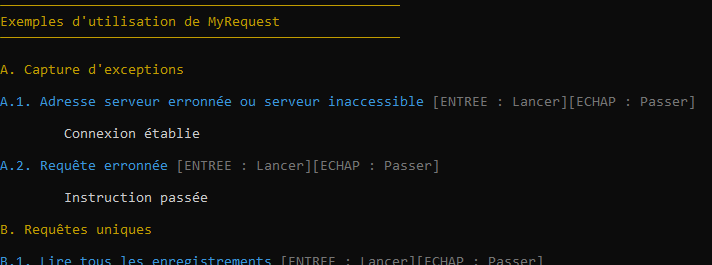

# ADOMyRequestSQL

## Présentation

Classe C# proposant des **fonctions factorisées de requêtes Transact-SQL préparées** avec **paramètres nommés par position ou par *placeholder*** et implémentant le *pattern* ***Dispose***.

Le projet nécessite le *package* NuGet **Microsoft.data.sqlclient**.

Le fichier de projet est modifié (double-clic sur son nom dans l'Explorateur de solution).
```xml
<Nullable>disable</Nullable>
```

L'accès à la base de données prend la forme d'un champ, dans la classe `MyRequest`, de type chaîne de caractères pointant sur une base de données **LocalDB**. On modifiera cette partie selon les besoins.

Du *pattern Dispose* : 
- [MSDN Quality rules](https://docs.microsoft.com/fr-fr/dotnet/fundamentals/code-analysis/quality-rules/ca1063),
- [MSDN Dispose](https://docs.microsoft.com/fr-fr/dotnet/standard/garbage-collection/implementing-dispose).

De la préparation des requêtes et des types de valeurs :
- [StackOverflow Types explicites](https://stackoverflow.com/questions/11938985/sqlcommand-prepare-method-requires-all-parameters-to-have-an-explicitly-set-type)

La classe `MyRequestPlaceholder` sert à la réalisation de requêtes à paramètres nommés par *placeholder*.

## Exemples

Avant de lancer l'application, au minimum, dans la classe `MyRequest`, renseigner une chaîne d'adresse valide dans le champ `_adressDB`.

Le fichier *Program.cs* présente des exemples d'utilisation. On suppose qu'une base de données est prête à l'emploi avec une collation `French_CI_AS` et qu'elle contient une table créée de la façon suivante :
```sql
USE NomBDD;

DROP TABLE IF EXISTS Test;

CREATE TABLE Test
(
    Id INT IDENTITY(1,1) NOT NULL,
    Prenom VARCHAR(50) NOT NULL,
    Nom VARCHAR(50) NOT NULL, 
    Inscription DATE NOT NULL,
    PRIMARY KEY CLUSTERED(Id ASC)
);

INSERT INTO 
    Test (prenom, nom, inscription)
VALUES
    ('Pré', 'Nom', '1999-12-31'),
    ('Toto', 'Zouzou', GETDATE())
;
```

Les exemples sont regroupés selon les catégories suivantes.
1. **Captures d'exception** : les instructions spécifiques de `MyRequest` se trouvent dans un bloc `try...catch` pour gérer les erreurs. 
2. **Requêtes uniques** : une requête par connexion à la base de données. Pas de gestion d'erreur, ceci afin de se concentrer sur l'usage de `MyRequest`,
3. **Requêtes multiples** : plusieurs requêtes par connexion à la base de données. Pas de gestion d'erreur, ceci afin de se concentrer sur l'usage de `MyRequest`.



## Fonctionnement

Le bloc général de contrôle prend la forme suivante. On spécialisera sans doute le type de l'exception. 
```csharp
try
{
    using(var mr = new MyRequest())
    {
        // traitements, requêtes multiples...
    }
}
catch (Exception e)
{
    Console.WriteLine(e.Message);
}
```

`MyRequest` présente un ensemble de méthodes publiques :
- `RequestReader()` : encapsule `SqlCommand.ExecuteReader()`, ne retourne rien,
- `RequestNonQuery()` : encapsule `SqlCommand.ExecuteNonQuery()`, retourne un entier représentant le nombre de lignes concernées par la requête,
- `RequestScalar()` : encapsule `SqlCommand.ExecuteScalar()`, retourne un type `Object`,
- `Dispose()` : libérer la ressource manuellement (hors usage de `using`).

De manière générale, les fonctions de requêtes prennent en charge les **paramètres nommés** par **position** et ont une surcharge pour accueillir des paramètres nommés par ***placeholder***. Concernant les paramètres nommés, la règle est la suivante :
- **par position**, le tableau de paramètres est **optionnel**. 
- **par *placeholder***, le tableau de paramètres est **obligatoire**. 

La préparation des requêtes, le typage des valeurs à passer pour les paramètres, sont des traitements gérés automatiquement par des méthodes privées et qui utilisent les types d'ADO.NET.

Exemple de `MyRequest.RequestReader()`. Le traitement lors de la lecture s'effectue au moyen d'une `Action` ; noter que le paramètre obligatoire `reader` sert au fonctionnement et ne renvoie à rien d'extérieur.
```csharp
using (MyRequest mr = new()) 
{
    mr.RequestReader("SELECT id, prenom, nom, inscription FROM Test", (reader) =>
    {
        Console.WriteLine($"{reader.GetInt32(0)}, {reader.GetString(1)}, {reader.GetString(2)}, {DateOnly.FromDateTime(reader.GetDateTime(3))}");
    });
}
```

La même fonction est utilisable avec un passage de paramètres nommés par position. 
```csharp
using (MyRequest mr = new())
{
    mr.RequestReader("SELECT prenom, nom, inscription FROM Test WHERE id=@0", (reader) =>
    {
        Console.WriteLine($"{reader.GetString(0)} {reader.GetString(1)}, {DateOnly.FromDateTime(reader.GetDateTime(2))}");
    },
    new object[] { 2 });
}
```

Idem avec un paramètre nommé par *placeholder* et un ordre des champs récupérés différent.
```csharp
int intId = 2;
mr.RequestReader("SELECT nom, prenom, inscription FROM Test WHERE id=@intID", (reader) => 
{
    Console.WriteLine($"{intId}, {reader.GetString(1)}, {reader.GetString(0)}, {DateOnly.FromDateTime(reader.GetDateTime(2))}");
}, 
new MyRequestPlaceholder[] { new("intID", intId) });
```

Exemple de `MyRequestScalar()`, sans paramètres nommés. On récupère un type `Object`, que l'on  convertit ensuite en `Int` car nous connaissons le type du champ `Id` de la table :
```csharp
object objMaxId = mr.RequestScalar("SELECT MAX(id) FROM Test");

if(objMaxId == null)
{
    Console.WriteLine("Erreur");
}
else
{
    int intMaxId = (int)objMaxId;
}
```

Exemple de `MyRequest.RequestNonQuery()` montrant que l'ordre des *placeholders* est libre.
```csharp
int lines = mr.RequestNonQuery("UPDATE Test SET nom=@nom, prenom=@prenom, inscription=@inscription WHERE id=@id", 
new MyRequestPlaceholder[] 
{
    new("id", 1),
    new("inscription", DateTime.Now),
    new("prenom", "MODIF"),
    new("nom", "MODIF"),
});
```

Pour effectuer plusieurs requêtes à la suite, il suffit d'écrire les fonctions les unes après les autres, dans le bloc `using`.
```csharp
using(var mr = new MyRequest())
{
    int id = 1;
    mr.RequestReader("SELECT prenom + ' ' + nom AS prenom_nom FROM Test WHERE id=@0", (reader) =>
    {
        Console.WriteLine($"{reader.GetString(0)}");
    }, new object[] { id });

    object deleted = mr.RequestScalar("DELETE FROM Test OUTPUT DELETED.id WHERE id=@0",
        new object[] { id });

    if(deleted == null)
    {
        Console.WriteLine("Erreur suppression");
    }
    else
    {
        Console.WriteLine($"L'enregistrement à l'id {(int)deleted} a été supprimé.");
    }
}
```